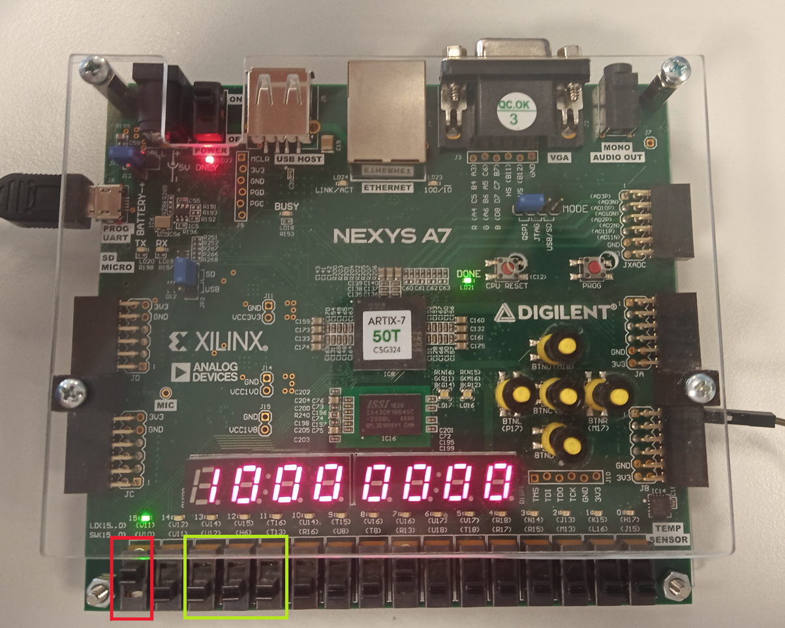

### Členové týmu

* Lukáš Kopřiva
* Aneta Bártková
* Jan Socha

## Teoretický popis a vysvětlení problému

Enter a description of the problem and how to solve it.

## Popis hardwaru
V tomto projektu využíváme desku nexys a7-50t od firmy Nexys. Tato deska nabízí mnoho možných vstupů a výstupů.
Námi použitými hlavními ovládacími prvky jsou přepínače. Dále jsme využili všechny sedmisegmentové displeje pro zobrazování odesílané/přijímané informace.

Přepínače máme rozděleny do tří částí. První (na obrázku hnědá) část stávající se z jednoho přepínače slouží k nastavení režimu vysílač/přijímač. Druhá část (červený rámeček) slouží k nastavení přenosové rychlosti. Více k této funkci v části instrukce. // vložit odkaz // Poslední část slouží k nastavení vysílaného slova o délce 8 bitů. Nastavené slovo se dá zkontrolovat na displeji. Tím se dostáváme k sedmisegmentovým displejům. Ty se přepínají podle zvolené 
Popis ovládacích prvků, vstup, výstup

Insert descriptive text and schematic(s) of your implementation.

## Popis softwaru

Put flowchats/state diagrams of your algorithm(s) and direct links to source/testbench files in `src` and `sim` folders. 

### Component(s) simulation

Write descriptive text and simulation screenshots of your components.

## Návod k obsluze

### Volba režimu

Nejdříve je potřeba si zvolit zda chceme vysílat nebo přijímat informace. To se nastavuje pomocí první páčky, která je na obrázku zvýrazněna červeným rámečkem. 

Pro režim vysílání je nutno páčku přepnout nahoru. To nám indikuje i svítící led dioda nad touto páčkou. 
Pokud chceme přijímat informace, páčku přepneme dolů a led dioda nám zhasne.  

### Volba rychlosti

Pro nastavení rychlosti uartu slouží tři páčky, které jsou na obrázku v zeleném rámečku.  
Na výběr jsou tyto rychlosti:
* 9600 BD/s - nastavení páček 000
* 4800 BD/s - nastavení páček 100
* 2400 BD/s - ostatní kobinace nastavení páček  

Přidání jiných rychlostí je možné pouze upravením souboru bd_rate_set.vhd.

### Režim přijímání dat

Pro správné přijímání dat je potřeba správně nastavit rychlost přenosu. Dále je potřeba na vysílači nastavit:
* Délku slova: 8 bitů
* Parity bit: ne
* Ukončovací bit: 1  

Přijaté 8 bitové slovo se zobrazuje na osmi sedmisegmentových displejích. 

### Režim odesílání dat

Při odesílání dat si musíme dát pozor na nastavení přijímající strany!  
Nastavení rychlosti odesílání je popsána [zde](#volba-rychlosti)  
Vysílač má pevně nastavené parametry:
* Délku slova: 8 bitů
* Parity bit: ne
* Ukončovací bit: 1  

K nastavení odesílaného slova slouží osm páček ve žlutém rámečku
Na sedmisegmentových displejích se nyní zobrazuje odesílané 8 bitové slovo. Vysílač odesílá zprávu pořád dokola dokud není vypnut nebo přepnut na přijímání dat.

## References

1. Put here the literature references you used.
2. ...
