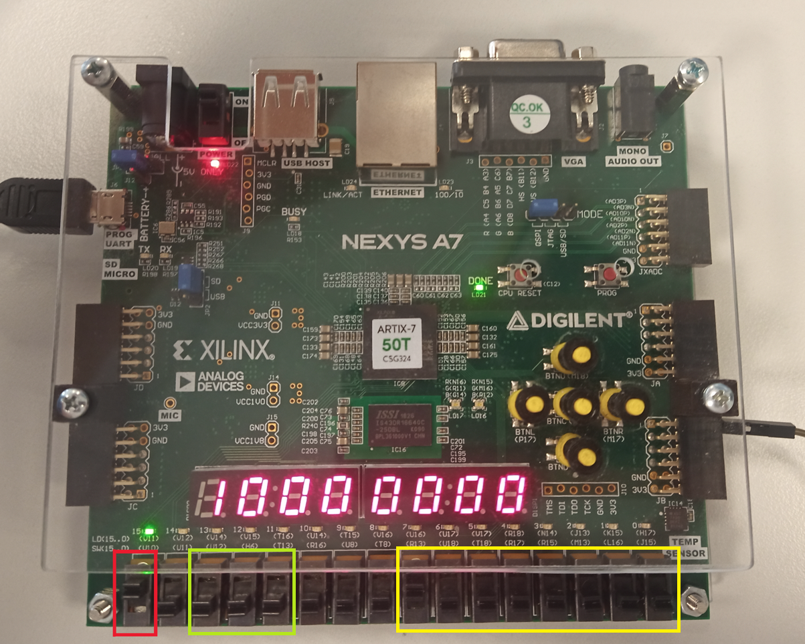

### Členové týmu

* Lukáš Kopřiva
* Aneta Bártková
* Jan Socha

## Teoretický popis a vysvětlení problému

Enter a description of the problem and how to solve it.

## Popis hardwaru
V tomto projektu využíváme desku nexys a7-50t od firmy Nexys. Tato deska nabízí mnoho možných vstupů a výstupů.
Námi použitými hlavními ovládacími prvky jsou přepínače. Dále jsme využili všechny sedmisegmentové displeje pro zobrazování odesílané/přijímané informace.

Přepínače máme rozděleny do tří částí. První (na obrázku hnědá) část stávající se z jednoho přepínače slouží k nastavení režimu vysílač/přijímač. Druhá část (červený rámeček) slouží k nastavení přenosové rychlosti. Více k této funkci v části instrukce. // vložit odkaz // Poslední část slouží k nastavení vysílaného slova o délce 8 bitů. Nastavené slovo se dá zkontrolovat na displeji. Tím se dostáváme k sedmisegmentovým displejům. Ty se přepínají podle zvolené 
Popis ovládacích prvků, vstup, výstup

Insert descriptive text and schematic(s) of your implementation.

## Popis softwaru

Put flowchats/state diagrams of your algorithm(s) and direct links to source/testbench files in `src` and `sim` folders. 

### Component(s) simulation

Write descriptive text and simulation screenshots of your components.

## Návod k obsluze

Nejdříve je potřeba si zvolit zda chceme vysílat nebo přijímat informace. To se nastavuje pomocí první páčky, která je na obrázku zvýrazněna červeným rámečkem.

Pro režim vysílání je nutno páčku přepnout nahoru. To nám indikuje i svítící led dioda nad touto páčkou.
Pokud chceme přijímat informace, páčku přepneme dolů a led dioda nám zhasne.
Write an instruction manual for your application, including photos or a link to a video.

## References

1. Put here the literature references you used.
2. ...
