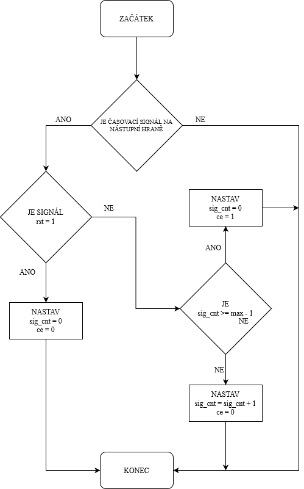

# VHDL projekt - UART
### Členové týmu

* Lukáš Kopřiva
* Aneta Bártková
* Jan Socha

## Teoretický popis a vysvětlení problému

UART (z anglického Universal asynchronous receiver-transmitter) je sběrnice, která slouží k asynchronnímu sériovému přenosu dat. K přenosu stačí dva drátky a nedochází k přenosu časového signálu.  

#### Přenos vypadá následovně:  

Nejdříve se vyšle start bit, který je reprezentován logickou 0. Následují bity přenášených dat. Po datech následuje paritní bit (dále parity bit), který je volitelný. Poslední odesílané bity jsou stop bity. Jejich počet je v některých aplikacích volitelný a je reprezentován logickou 1.  
Pokud vysílač nevysílá informaci, tak je signál na logické 1, aby mohlo dojít k detekci start bitu.  

#### Příklad přenosu:

Chci přenést 8 bitovou zprávu (11100110), bez parity bitu s jedním stop bitem.  
Nejdříve začnu start bitem 0, poté odešlu dané slovo 11100110 a poté následuje stop bit 1. Celá odesílaná sekvence tedy bude 0111001101.  
Na informačním kanále to vypadá poté nějak následnovně:  
11111110111001101111111  

## Popis hardwaru
V tomto projektu využíváme desku nexys a7-50t od firmy Nexys. Tato deska nabízí mnoho možných vstupů a výstupů.
Námi použitými hlavními ovládacími prvky jsou přepínače.

  

Přepínače máme rozděleny do tří částí. První (červený rámeček) část stávající se z jednoho přepínače slouží k nastavení režimu vysílač/přijímač. Druhá část (zelený rámeček) slouží k nastavení přenosové rychlosti. Více k této funkci [zde](#volba-rychlosti). Poslední část slouží k nastavení vysílaného slova o délce 8 bitů. Nastavené slovo se dá zkontrolovat na sedmisegmentových displejích. 

Vstup a výstup je na boku destičky. Pro větší přehlednost jsme využili piny JA(zelený rámček) a JB(červený rámeček). Pin JA slouží jako vstup pro vysílač a JB slouží jako výstup pro vysílač.  

  

Insert schematic(s) of your implementation.

## Popis softwaru

Z časových důvodů je  pouze pro simulaci top.vhd, ale díky tomuto simulačnímu soubrou, lze odsimulovat všechny komponenty. 
Poznámka: vysílač i přijímač jsou v jednom souboru s názvem rx_tx.vhd.  

#### Vysílač

* 

 

#### Přijímač
* 

 

#### Nastavení rychlosti
* 

 

#### všechny druhy clk_enable

V programu se objevují tři verze komponenty clock enable. První je základní verze, která byla vytvořena během semestru. Další verze se liší pouze ve dvou věcech:
* clock_enable_rx má možnost aktivace/deaktivace pro účely přijímače, dále má možnost proměnného nastavení maximální hodnoty při běhu programu
* clock_enable_tx má možnost nastavení maximální hodnoty při běhu programu

V plánu bylo sjednotit všechny čítače do jednoho typu a náležitě upravit program. Na tento krok již z časových důvodů nedošlo. 

##### clock_enable_rx

* 

 

##### clock_enable_tx

* 

 

#### všechny druhy čítačů

V programu se objevují tři verze komponenty counter. První je , která byla vytvořena během semestru a stará se o chod sedmisegmentového displeje. Další dvě verze se liší v:
* tx_cnt_up nemá žádnou funkční změnu
* rx_cnt_up má defaultně nastavené počítání od nejmenšího po největší, dále má možnost interního resetu, který není závislý na resetu ostatních komponent, tedy na hlavním reset signálu. Poslední změnou je možnost deaktivace samotného čítače pomocí signálu cnt_en.

##### tx_cnt_up a základní verze

* 

 

#### rx_cnt_up

* 

 

### Component(s) simulation

Write descriptive text and simulation screenshots of your components.

## Návod k obsluze

### Volba režimu

Nejdříve je potřeba si zvolit zda chceme vysílat nebo přijímat informace. To se nastavuje pomocí první páčky, která je na obrázku zvýrazněna červeným rámečkem. 

Pro režim vysílání je nutno páčku přepnout nahoru. To nám indikuje i svítící led dioda nad touto páčkou. 
Pokud chceme přijímat informace, páčku přepneme dolů a led dioda nám zhasne.  

### Volba rychlosti

Pro nastavení rychlosti uartu slouží tři páčky, které jsou na obrázku v zeleném rámečku.  
Na výběr jsou tyto rychlosti:
* 9600 BD/s - nastavení páček 000
* 4800 BD/s - nastavení páček 100
* 2400 BD/s - ostatní kobinace nastavení páček  

Přidání jiných rychlostí je možné pouze upravením souboru bd_rate_set.vhd.

### Režim přijímání dat

Pro správné přijímání dat je potřeba správně nastavit rychlost přenosu. Dále je potřeba na vysílači nastavit:
* Délku slova: 8 bitů
* Parity bit: ne
* Ukončovací bit: 1  

Přijaté 8 bitové slovo se zobrazuje na osmi sedmisegmentových displejích. 

### Režim odesílání dat

Při odesílání dat si musíme dát pozor na nastavení přijímající strany!  
Nastavení rychlosti odesílání je popsáno [zde](#volba-rychlosti).  
Vysílač má pevně nastavené parametry:
* Délku slova: 8 bitů
* Parity bit: ne
* Ukončovací bit: 1  

K nastavení odesílaného slova slouží osm páček ve žlutém rámečku. Na sedmisegmentových displejích se nyní zobrazuje odesílané 8 bitové slovo.  
Vysílač odesílá zprávu pořád dokola dokud není vypnut (odpojení od napájení) nebo přepnut na přijímání dat.

### Video ukázka ovládání

## References

1. Put here the literature references you used.
2. ...
